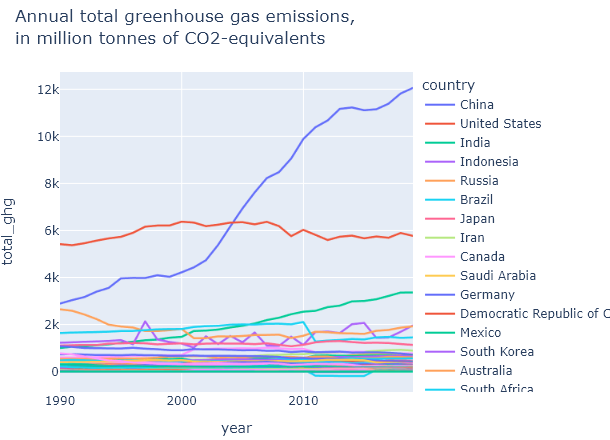

## Milestone 1 (7th April, 5pm)

**10% of the final grade**

This first milestone is dedicated to the explanation and assesment of the feasability of our project. Let us guide you through our ideas...

## Dataset

The first dataset, available at [Our World In Data - GHG emissions](https://ourworldindata.org/co2-and-greenhouse-gas-emissions#licence), presents global carbon dioxide (CO2) and greenhouse gas (GHG) emissions from 1750 to 2021. The data are sourced from a variety of international organizations, including the International Energy Agency (IEA), the United Nations Framework Convention on Climate Change (UNFCCC), and the Global Carbon Project.

The second dataset, available at [Our World In Data - GHG by sector](https://ourworldindata.org/emissions-by-sector#annual-greenhouse-gas-emissions-by-sector), presents global GHG emissions by sector from 1960 to 2016. The data are sourced from the same international organizations as the first dataset, and are broken down by sector, including industry, transport, agriculture, and electricity.

Both datasets are of high quality, with data sourced from reputable international organizations and presented in a clear and accessible manner. The data are also regularly updated, ensuring that users have access to the latest information.

The topic of these datasets, GHG emissions and their impact on the environment, is of significant relevance in today's world, as climate change continues to be a major global challenge. The datasets provide valuable information for policymakers, researchers, and the public, helping to inform decisions on climate change mitigation and adaptation strategies.

However, the datasets are complex and may require some technical expertise to fully understand and analyze, the EDA sections will go deeper in this sense. Additionally, while the datasets cover global emissions, there may be limitations in terms of data availability for specific countries or regions.

Overall, the datasets provide a comprehensive and valuable resource for understanding global GHG emissions and their impact on the environment, and are a valuable tool for informing climate change policy and decision-making.

## Problematic

One could understand from the description of the datasets that the main topic of our visualization project is the worldwide repartition of GHG emissions.

The emission of these gases is a widely discussed topic in the media, as it has significant implications for the environment and human society. However, despite its importance, the topic can be complex and difficult to understand, which can make it difficult for the general public to engage with the issue and take action to reduce emissions.

To help address this challenge, our visualization will be based on an interactive map, to explain the distribution of emissions around the globe in a way that is easy to understand. This map will display the data in an engaging and striking approach so that it has impact to the reader.

By making this information more accessible and engaging, the interactive map aims at raising awareness of the importance of reducing GHG emissions and the need for collective action to address climate change. This would help foster a greater sense of urgency and commitment among individuals to take action to reduce emissions and transition to a low-carbon economy.

In order to meet the above-mentioned purposes, we want to create an interactive world map, containing both spatial and temporal information: total GHG emissions will be displayed for each country using a colormap and a time slider will enable the reader to travel through years. When the user would hover over a country, name and numerical value would be displayed and if the user clicks on the country, a second graph would be displayed. This graph would represent a barplot comparing the main sectors responsible for GHG emissions in this country, to better understand the different factors at stake. In addition to these graphs, an interactive time evolution of all the countries will be displayed. These ideas are sketched below. We can also explore the possibility to add the time evolution of global worldwide GHG emissions, or by continents, so that a broad overview would be presented. 

<em> Sketch of the interactive world map idea.</em>

    
    
    <em> Sketch of the sector barplot for one country.</em>
    <em> &emsp;&emsp;&emsp;&emsp;&emsp;&emsp;&emsp;   Sketch of the time evolution of all countries.</em>

## Exploratory Data Analysis

Firstly, we explored the world regions present in the 2 datasets. It appears that all the 193 countries are present in both, which is great. In addition, continents and income-based classification also have entries, and there is a row for the world. Until now, we focused our analysis on the countries.

Then, we performed a time analysis. The first dataset contains years ranging from 1750 to 2021, however only years 1990 to 2021 have entries for each of the 193 countries. Concerning the second dataset, entries range from 1990 to 2019. Thus, a rather large time period overlapps between the two datasets.

A first NaNs exploration was performed on the countries datasets, between 1990 and 2019. For the first, along the most interesting entries:
- the column total_ghg, counting the annual total greenhouse gas emissions in million tonnes of CO2-equivalents, does not contain any NaNs,
- the columns co2, gas_co2, coal_co2, flaring_co2, oil_co2 contain a small number of NaNs (around 20),
- the columns cement_co2, land_use_change_co2 contain more missing entries (up to 330),
- the columns trade_co2 and other_industry_co2 have a large number of NaNs (up to 4440).  
For the second dataset, up to 155 NaNs are present for most of the sectors.  

From the first dataset, we displayed the annual total greenhouse gas emissions, the annual total production-based emissions of CO₂, and the annual production-based emissions of CO₂ from different sources (cement, coal, flaring, gas, land-use-change, oil, other industries, trade). You can find below the graph of the annual total greenhouse gas emissions, where we can observe that China gradually imposed itself, exceeding the United States in the early 2000s, and continues to increase. The United States, now second, stayed overall contant between 1990 and 2019. Another country with continuously increasing global emissions in India, while Russia was quite high overall in the early 1990s, decreased for 20 years but is now increasing again. Trends however vary based on the source, but China and USA are often the top-emitters. An example of a specific source is also displayed here, for gas.

  
 

Using the second dataset, which provides GHG emissions for different sectors (Agriculture,	Land-use change and forestry,	Waste,	Industry,	Manufacturing and construction,	Transport,	Electricity and heat,	Buildings,	Fugitive emissions,	Other fuel combustion,	Aviation and shipping) we found the highest GHG-emitting sector for each country per year. We compared in a barplot the highest sectors in 1990 and in 2019, for each country.

More details about our EDA could be found in [EDA.ipynb](./../EDA.ipynb).

## Related work

// put this here, was before in the dataset part: ... The data are presented in various formats, including tables, graphs, and interactive visualizations. ... //

> - What others have already done with the data?

From the [Emissions by sector]([url](https://ourworldindata.org/emissions-by-sector#sector-by-sector-where-do-global-greenhouse-gas-emissions-come-from)), we could obtain the CO2 emission evolution by sector by the selected country, which help us have a great understanding about the CO2 emission trend in the country that audiences have interests.

> - Why is your approach original?

Compared to the research above, we produce a broader view about the CO2 emission around the world not just focusing on an interested country, therefore, the audience could compare the CO2 emission between countries. Besides, they could explore the CO2 emission information on the countries that they have not noticed before. What's more, we hope to make our visualization as interactive as possible so that audiences have higher flexibility to explore the information they want.

> - What source of inspiration do you take? Visualizations that you found on other websites or magazines (might be unrelated to your data). 

Our source of inspiration is from [worldpoverty]([url](https://worldpoverty.io/map)) website, which produces a interactive world map with high flexibility. Our goal is trying to visualize the information in a convienient, concise and polished way.
