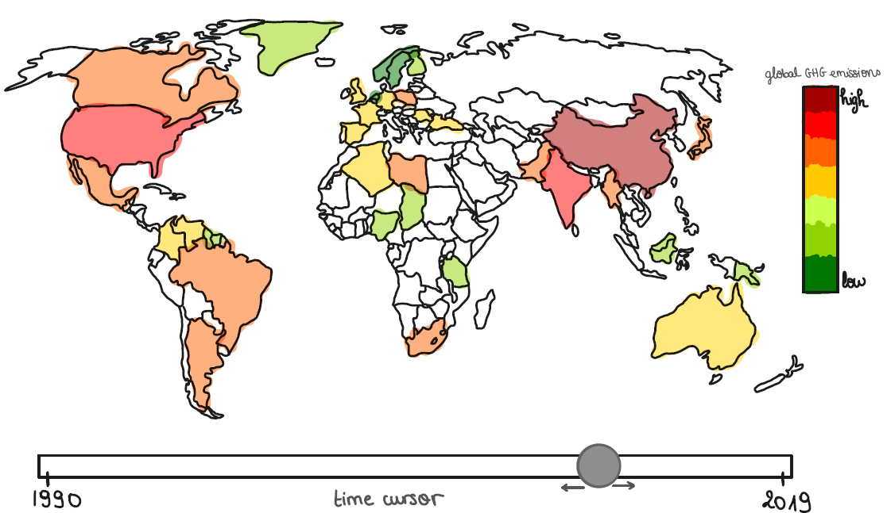
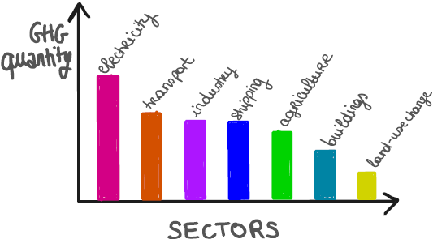

Milestone 2 (Friday 1st May, 5pm)

10% of the final grade

Two A4 pages describing the project goal.

• Include sketches of the vizualiation you want to make in your final product.

<em> Sketch of the interactive world map idea.</em>

    
    <em> Sketch of the sector barplot for one country.</em>

MAYBE ALSO: BY CONTINENT, AND WHEN CLICK: BUBBLES FOR EACH COUNTRY?

• List the tools that you will use for each visualization and which (past or future) lectures you will need.

• Break down your goal into independent pieces to implement. Try to design a core visualization (minimal viable product) that will be required at the end. Then list extra ideas (more creative or challenging) that will enhance the visualization but could be dropped without endangering the meaning of the project. Functional project prototype review.

Extra idea: add timeline with some GHG-related news below the time cursor !

• You should have an initial website running with the basic skeleton of the visualization/widgets.
